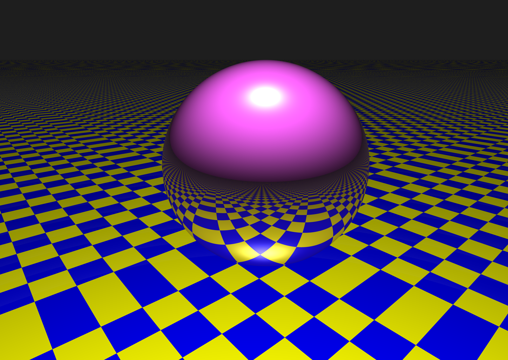
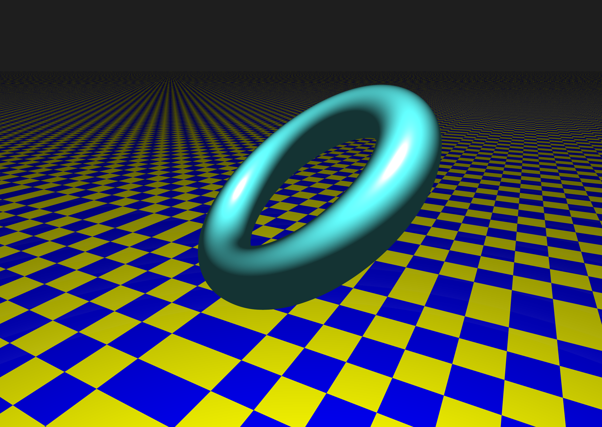

# Ray_Tracing

Here is the [link](https://kteruuchi.github.io/Ray_Tracing/).

## Sample
 

## Command
| Command | About |
|:--------|-------|
|`clear`| clear all log |
|`hide log`| change visibility 'hidden' |
|`show log`| change visibility 'visible' |
|`scale` number | rerender. recommended number is .1 to 1 |
|`wireframe` or `wf`| switch view mode |
|`save` name? | save as 'name'.png or download.png |
